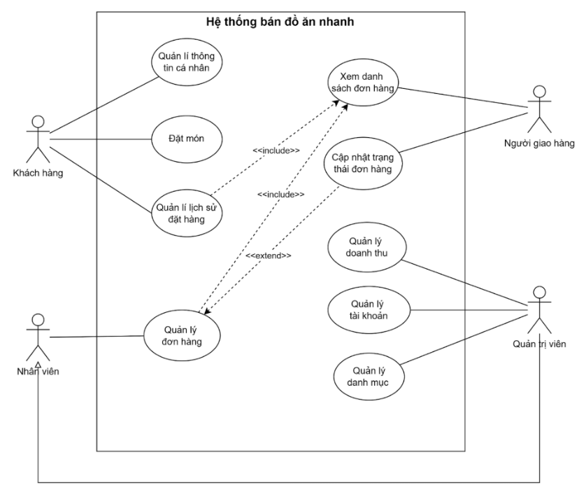
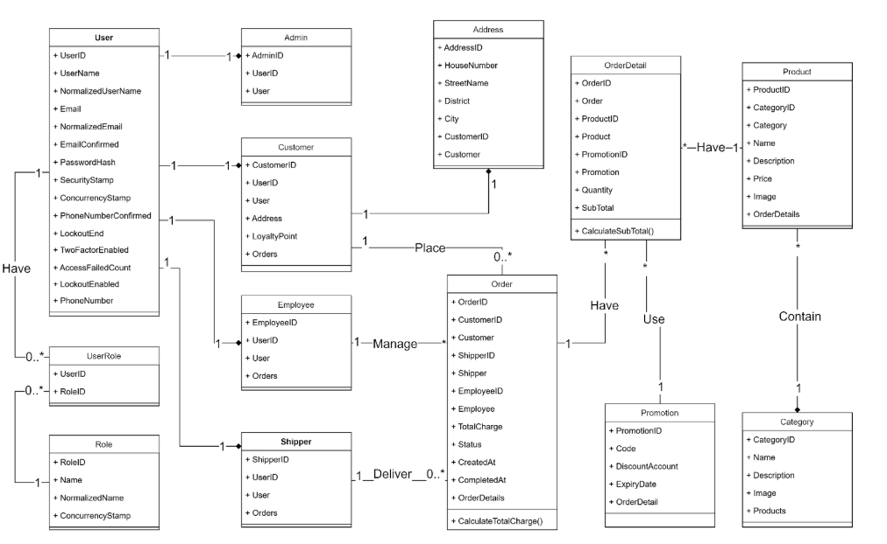
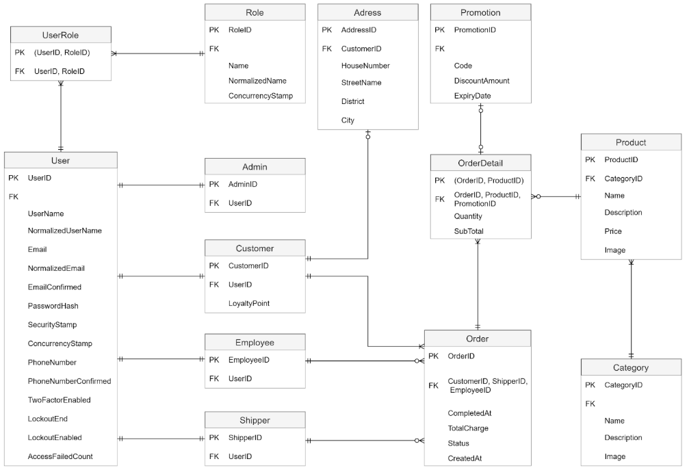

# FastFood.MVC - Nền Tảng Quản Lý và Bán Hàng Đồ Ăn Nhanh

Một ứng dụng web được xây dựng với ASP.NET Core MVC nhằm cung cấp giải pháp toàn diện cho các cửa hàng bán đồ ăn nhanh. Ứng dụng cho phép khách hàng mua sắm trực tuyến, quản lý đơn hàng, và cung cấp cho các nhân viên công cụ mạnh mẽ để quản lý sản phẩm, đơn hàng, và giao hàng.

---

## Các Tính Năng Chính

- Xác Thực & Phân Quyền: Hỗ trợ xác thực dựa trên Role (Admin, Employee, Shipper, Customer) với ASP.NET Core Identity
- Giỏ Hàng: Thêm/xóa sản phẩm, quản lý số lượng, tính toán tổng tiền
- Quản Lý Đơn Hàng: Khách hàng có thể xem lịch sử đơn hàng; Nhân viên có thể cập nhật trạng thái đơn hàng; Shipper có thể quản lý giao hàng
- Khuyến Mãi & Giảm Giá: Quản lý mã khuyến mãi, áp dụng giảm giá cho đơn hàng
- Dashboard Admin: Thống kê bán hàng, quản lý người dùng, quản lý sản phẩm
- Hệ Thống Thông Báo: Cập nhật trạng thái đơn hàng cho khách hàng và nhân viên
- Hệ Thống Tin Nhắn: Khách hàng có thể liên hệ với cửa hàng
- Quản Lý Người Dùng: Admin có thể quản lý tài khoản người dùng, gán vai trò
- Lưu Trữ Hình Ảnh: Tích hợp Azure Blob Storage cho lưu trữ hình ảnh sản phẩm

---

## Tech Stack

| Công Nghệ | Phiên Bản | Mục Đích |
|-----------|----------|---------|
| ASP.NET Core | 8.0 | Framework chính cho web application |
| C# | 12.0 | Ngôn ngữ lập trình |
| Entity Framework Core | 8.0 | ORM cho truy cập dữ liệu |
| SQL Server | 2017+ | Cơ sở dữ liệu |
| Razor | - | Templating engine cho views |
| ASP.NET Core Identity | - | Xác thực và quản lý người dùng |
| Azure Blob Storage | - | Lưu trữ hình ảnh trên cloud |
| Bootstrap | 5.x | CSS framework cho giao diện |
| jQuery | 3.x | JavaScript library |

---

## Kiến Trúc

Ứng dụng tuân theo mô hình MVC (Model-View-Controller):

```
FastFood.MVC/
├── Controllers/          # Xử lý yêu cầu từ client
├── Models/              # Định nghĩa các entity dữ liệu
├── Views/               # Giao diện người dùng (Razor views)
├── Services/            # Chứa business logic
├── ViewModels/          # Dữ liệu để truyền cho views
├── Data/                # Database context và migrations
├── Helpers/             # Các hàm tiện ích
└── wwwroot/             # Static files (CSS, JS, images)
```

---

## Sơ Đồ Thiết Kế

### Sơ Đồ Use Case


### Sơ Đồ Lớp


---

## Cơ Sở Dữ Liệu

### Sơ Đồ ER (Entity-Relationship)


Các Bảng Chính:
- Users - Thông tin người dùng (ASP.NET Identity)
- Customers - Thông tin khách hàng
- Employees - Thông tin nhân viên
- Shippers - Thông tin người giao hàng
- Products - Danh sách sản phẩm
- Categories - Danh mục sản phẩm
- Orders - Đơn hàng
- OrderDetails - Chi tiết đơn hàng
- CartItems - Giỏ hàng
- Promotions - Khuyến mãi
- Messages - Tin nhắn từ khách hàng
- Notifications - Thông báo

---

## Cài Đặt & Thiết Lập

### Yêu Cầu Hệ Thống

**Hardware:**
- CPU: 1.4 GHz hoặc cao hơn
- RAM: Tối thiểu 4 GB (Khuyên dùng 8 GB trở lên)
- Ổ cứng: 10 GB dung lượng trống

**Software:**
- Windows 10/11 hoặc Windows Server 2016+
- .NET SDK 8.0 hoặc cao hơn
- SQL Server 2017 Express hoặc cao hơn
- Visual Studio 2022 hoặc Visual Studio Code

### Các Bước Cài Đặt

#### 1. Clone hoặc Tải Dự Án
```bash
git clone <repository_url>
cd FastFood.MVC
```

#### 2. Thiết Lập Connection String
Mở file `appsettings.json` và cập nhật connection string cho SQL Server:
```json
{
  "ConnectionStrings": {
    "DefaultConnection": "Server=.\\SQLEXPRESS;Database=FastFoodDB;Trusted_Connection=True;MultipleActiveResultSets=true;TrustServerCertificate=True"
  }
}
```

#### 3. Tạo Database & Chạy Migrations
```bash
dotnet ef database update
```

#### 4. Cấu Hình User Secrets
```bash
dotnet user-secrets init
```

Thêm các thông tin sau vào `secrets.json`:
```json
{
  "AdminCredentials": {
    "Email": "admin@example.com",
    "Password": "admin@123"
  },
  "EmailSettings": {
    "Email": "your-email@gmail.com",
    "Password": "your-app-password"
  },
  "AzureBlob": {
    "ConnectionString": "your-connection-string",
    "ContainerName": "fastfood-container"
  }
}
```

**Lưu ý về Mật Khẩu Email Gmail:**
1. Truy cập tài khoản Google cá nhân
2. Chọn Bảo mật → thực hiện Xác thực 2 lớp (nếu chưa có)
3. Tìm kiếm "Mật khẩu ứng dụng" → tạo mật khẩu mới cho Gmail
4. Sử dụng mật khẩu này trong cấu hình EmailSettings

#### 5. Chạy Ứng Dụng
**Sử dụng Visual Studio:**
- Mở file `FastFood.MVC.sln`
- Nhấn Ctrl+F5 hoặc chọn "Start Without Debugging"

**Sử dụng .NET CLI:**
```bash
dotnet run
```

Ứng dụng sẽ khởi động tại `https://localhost:5001`

### Xử Lý Sự Cố Thường Gặp

| Vấn Đề | Giải Pháp |
|--------|----------|
| Lỗi kết nối cơ sở dữ liệu | Kiểm tra connection string trong `appsettings.json` và đảm bảo SQL Server đang chạy |
| Lỗi Migration | Xóa các migration cũ và chạy lại `dotnet ef database update` |
| Static files không tải | Kiểm tra đường dẫn trong views hoặc chạy `dotnet run` lại |
| Lỗi Email không gửi được | Xác nhận mật khẩu ứng dụng Gmail và kích hoạt xác thực 2 lớp |

---

## Đóng Góp

Nếu bạn muốn đóng góp, vui lòng:
1. Fork dự án
2. Tạo branch mới (`git checkout -b feature/YourFeature`)
3. Commit thay đổi (`git commit -m 'Add YourFeature'`)
4. Push lên branch (`git push origin feature/YourFeature`)
5. Mở Pull Request

---

## Liên Hệ & Hỗ Trợ

Nếu bạn gặp vấn đề hoặc có câu hỏi, vui lòng tạo một issue trên repository hoặc liên hệ với nhóm phát triển.

---

Cập nhật lần cuối: April 1, 2026
